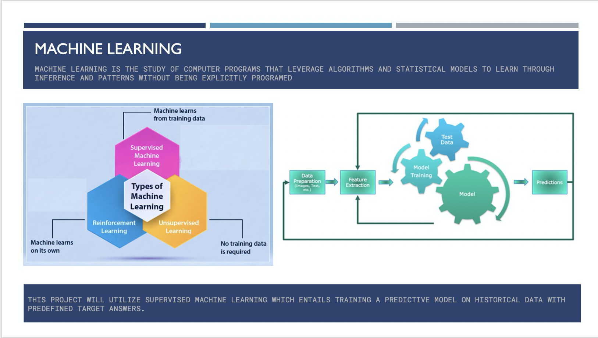
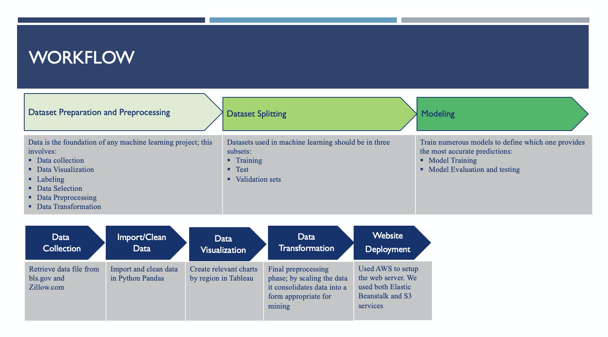

# CovidSurviving-Economics
Group Project Exploring Real State and Labor Markets

**Project Overview**

After a record-setting 2019, the US economy started off 2020 with another strong job market. In January, job gains beat expectations, wages grew above 3%, and unemployment rates remained at or near historic lows.

Unfortunately, all of this changed drastically. We are currently living in a global pandemic, this economic crisis unleashed by the outbreak of COVID-19 is hurting economies, regardless of income level. With unemployment on the rise and state by state reopening’s; we are now in a survival mode climate.

This project will be based on the analysis of unemployment data in the current COVID-19 climate and the impact on single-family home pricing by region.

*Scope:*
Utilizing Machine Learning and leveraging unemployment data from the U.S. Bureau of Labor Statistics (BLS), we will analyze the impacted of the current unemployment rate in New York, California, Texas and Florida as it relates to the correlation and prediction of single-family home sales prices for the identified regions. Some of the questions that arose during the data collection process were; Will an increase in unemployment negatively affect the real estate market in that region? If the real estate market is affected negatively will there be a change in the coming months?

To accurately answer these questions data from bls.gov and zillow.com; will be measured from 2019 to 2020 and we will utilize Supervised Machine Learning (which entails training a predictive model on historical data) to target answers

---

**Machine Learning**  

Machine Learning is the study of computer programs that leverage algorithms and statistical models to learn through inference and patterns without being explicitly programed

This project applies supervised Machine Learning which entails training a predictive model on historical data with predefined target answers.

---

**Workflow**

We leveraged unemployment data from the U.S. Bureau of Labor Statistics (BLS) and the most recent real estate data for single family home prices on zillow.com; To accurately determine if a spike in unemployment negatively affected the single home prices.
